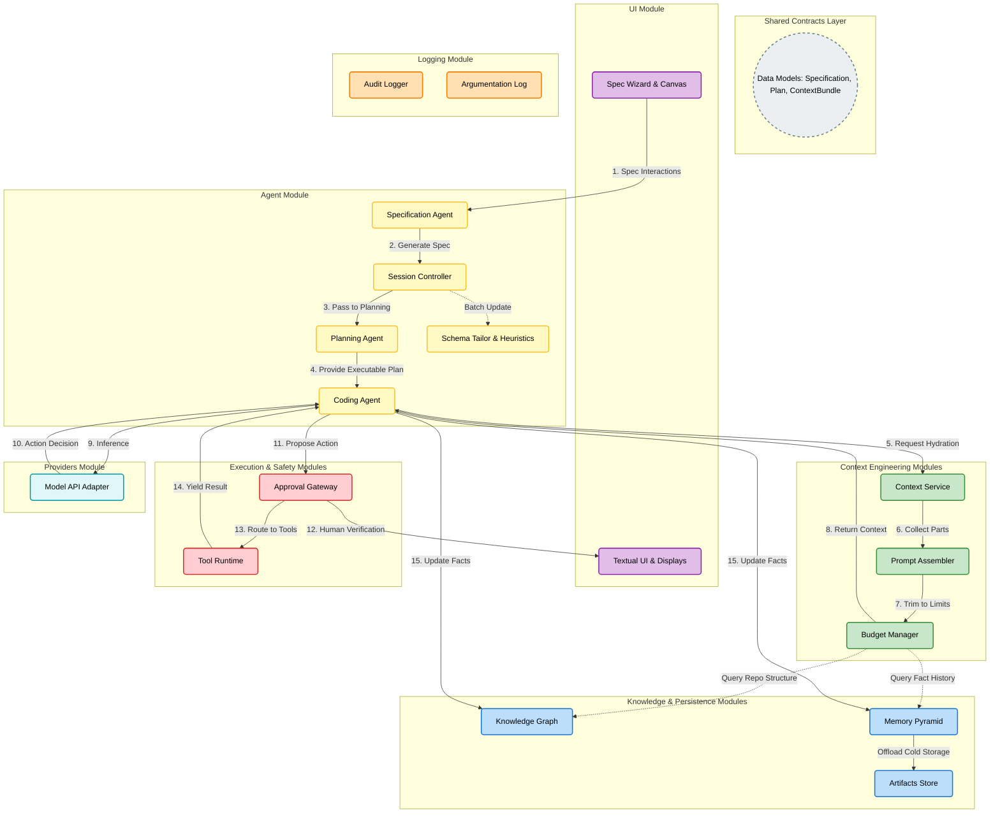
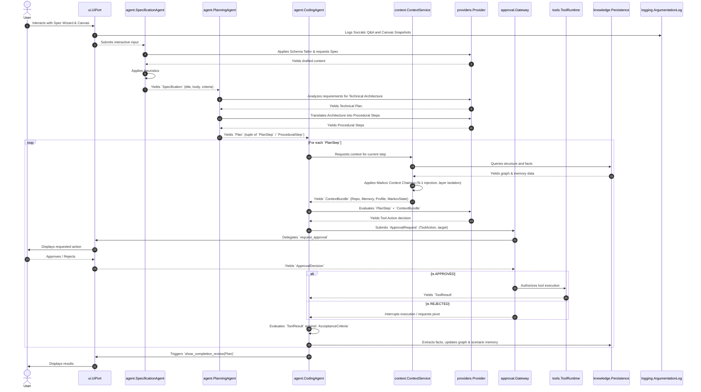

# Corge Tactical System Design

This document provides a detailed, human-readable view of Corge's tactical system design. It highlights the strict modular separation, the internal components of each module, and the structured flow of execution.

## System Architecture & Module Execution

The diagram below separates the system into distinct color-coded modules. The arrows demonstrate a numbered, logical execution flow, illustrating how a specification is built, planned, hydrated with context, approved, and executed.

---

---

## Tactical Module Breakdown

To maintain the modular monolith, cross-communication is heavily restricted. Each module handles a precise slice of the architecture.

### 1. UI Module (Purple)
- **Role**: Pure presentation layer with zero business logic.
- **Components**: Handles the directory selector (supporting visual context, safe folder creation, escape-based cancellation, hidden files toggles, and direct LLM API configuration via the ProviderConfigScreen), the specification wizard, the interactive Freestyle Canvas with sticky notes (supporting confirmation-protected clearing), formatting repository analysis for the user, the step by step plan outputs side by side with structured specs output, throwing human-in-the-loop approval requests (featuring live code diff toggles and read-only details to prevent misleading edits), custom confirmation screens (ConfirmScreen) for opt-ins and destructive prompts, ensuring default initial focus on screen mount for keyboard-only usability, structured audit log parsing and formatting, displaying completion review, and providing explicit "Back" buttons on screens to allow navigating back to the previous screen or lifecycle state (supporting backspace/escape keyboard bindings).

### 2. Agent Modules (Yellow)
- **Role**: The operational state machine and learning engine.
- **Components**: Divided into three master phase-specific agents: 
  - `Specification Agent`: handles SpecState reiterations, supporting opt-in Socratic spec questions (capped at a configurable threshold to prevent cognitive overload, with support for iterative rounds), dynamic LLM refinement of spec content based on user answers, formatting of remaining gaps into inline markdown templates, and merging user manual edits back into structured specification fields.
  - `Planning Agent`: handles PlanState reiterations (generating Technical Plans and Procedural Steps, parsing and preserving custom bracketed step identifiers in user-edited step descriptions).
  - `Coding Agent`: handles the tool execution loop. 
  - `Schema Tailor`: for framework-aware prompts 
  - `Heuristic Updater`: for Bayesian self-improvement of the spec wizard in a subsequent, post-execution phase. 
  - `Session Controller`: manages transitions between these three master phases, implementing robust backward navigation on cancel/rejection (including back-navigation buttons on all major screens), wrapping bootstrap connection errors with actionable advice, and step-retry loops on tool failures. 

### 3. Context Engineering Modules (Green)
- **Role**: Gathering and optimizing context data to ensure LLM interactions are precise and under token limits.
- **Components**: 
  - `Context Service`: retrieves relevant context for each agent when needed, from the: repo knowledge base, user profiles, user inputs and memory pyramid, enforcing context-layer isolation and applying context-chaining policies. 
  - `Prompt Assembler`: gathers context inputs for the current step, selects the appropriate `schema` for the current phase, and uses `schema tailoring` to generate framework-aware prompts. The assembler's templates are structured to place static components (schemas, specification, facts) at the beginning of the prompt to maximize LLM prompt/prefix caching.
  - `Budget Manager`: aggressively clips, deduplicates, and condenses context inputs to fit strict context windows when needed.

### 4. Knowledge & Persistence Modules (Blue)
- **Role**: The source of long-term and short-term facts of the codebase and project.
- **Components**: 
  - `Knowledge Graph`: maps the structural repository state.
  - `Memory Pyramid`: retains past execution lessons (L0-L3), and 
  - `Artifact Store`: securely offloads bulk content.

### 5. Execution & Safety Modules (Red)
- **Role**: The only module that modifies the local environment.
- **Components**: 
  - `Approval Gateway`: intercepts tool requests and guarantees nothing runs without consent, presenting live diffs of proposed code edits for verification prior to execution.
  - `Tool Runtime`: validates command execution safety (blocking privilege escalation and escaping deletions) and runs `read`, `write`, `edit`, and `bash` once authorized.

### 6. Shared Contracts Layer (Grey)
- **Role**: Defines the strict boundary objects and interfaces that traverse modules. 
- **Rule**: Modules communicate by passing models (e.g., `Specification`, `ApprovalRequest`) to interface ports (`typing.Protocol`), completely preventing hidden tight coupling and achieving high modularity and maintainability.

### 7. Providers Module
- **Role**: Model API adapter and integration point.
- **Components**: The `Provider` class implements an OpenAI-compatible adapter supporting OpenAI (with automatic prompt caching), DeepSeek (with prefix caching), and Ollama (with keep-alive support). It automatically handles reasoning/thinking models by stripping `<think>...</think>` tags from content and populating standardized usage fields.

### 8. Logging Module
- **Role**: Accountability, audit trailing, and historical learning data.
- **Components**: 
  - `AuditLogger` defines the interface for recording state transitions, tool invocations, and approvals. 
  - `ArgumentationLog` records Socratic Q&A and canvas snapshots to `argumentation_log.json`, to be consumed by the batch-phase heuristic updater.

