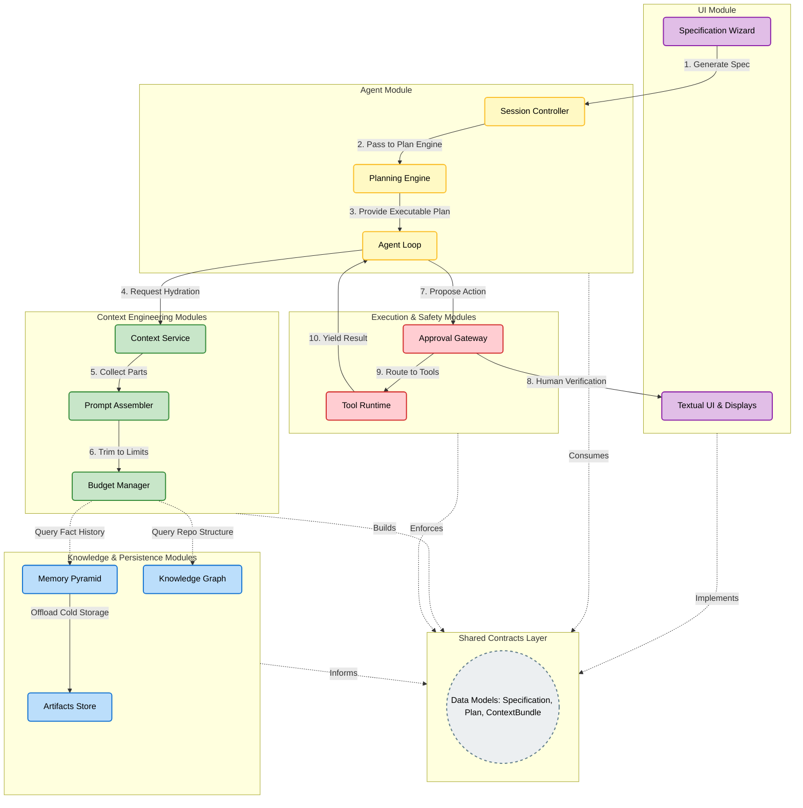
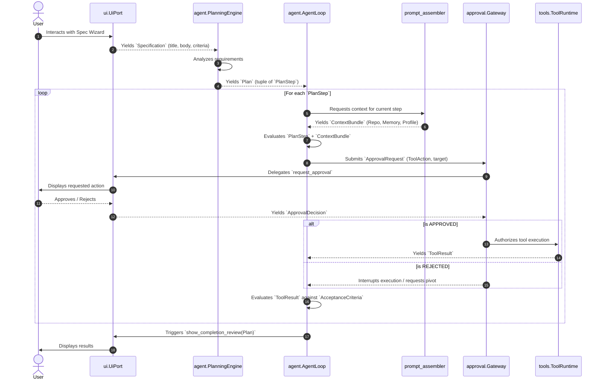

# Corge Tactical System Design

This document provides a detailed, human-readable view of Corge's tactical system design. It highlights the strict modular separation, the internal components of each module, and the structured flow of execution.

## System Architecture & Module Execution

The diagram below separates the system into distinct color-coded modules. Rather than a complex web of unreadable dependencies, the arrows demonstrate a numbered, logical execution flow, illustrating how a specification is built, planned, hydrated with context, approved, and executed.

---

---

## Tactical Module Breakdown

To maintain the modular monolith, cross-communication is heavily restricted. Each module handles a precise slice of the architecture:

### 1. UI Module (Purple)
- **Role**: Pure presentation layer with zero business logic.
- **Components**: Handles the specification wizard, formatting repository analysis for the user, and throwing human-in-the-loop approval requests.

### 2. Agent Module (Yellow)
- **Role**: The core operational state machine.
- **Components**: The `Planning Engine` converts specs into strict plans. The `Agent Loop` consumes steps but relies completely on other modules to fetch context or execute tools. 

### 3. Context Engineering Modules (Green)
- **Role**: Gathering and optimizing data to ensure LLM interactions are precise and under token limits.
- **Components**: The `Prompt Assembler` gathers raw inputs. The `Budget Manager` aggressively clips, deduplicates, and condenses them to fit strict context windows.

### 4. Knowledge & Persistence Modules (Blue)
- **Role**: The source of long-term and short-term facts.
- **Components**: The `Knowledge Graph` maps the structural repository state. The `Memory Pyramid` retains past execution lessons (L0-L3), and the `Artifact Store` securely offloads bulk content.

### 5. Execution & Safety Modules (Red)
- **Role**: The only module that modifies the local environment.
- **Components**: The `Approval Gateway` intercepts tool requests and guarantees nothing runs without consent. The `Tool Runtime` blindly runs `read`, `write`, `edit`, and `bash` commands once authorized.

### 6. Shared Contracts Layer (Grey)
- **Role**: Defines the strict boundary objects and interfaces that traverse modules. 
- **Rule**: Modules communicate by passing models (e.g., `Specification`, `ApprovalRequest`) to interface ports (`typing.Protocol`), completely preventing hidden tight coupling.
